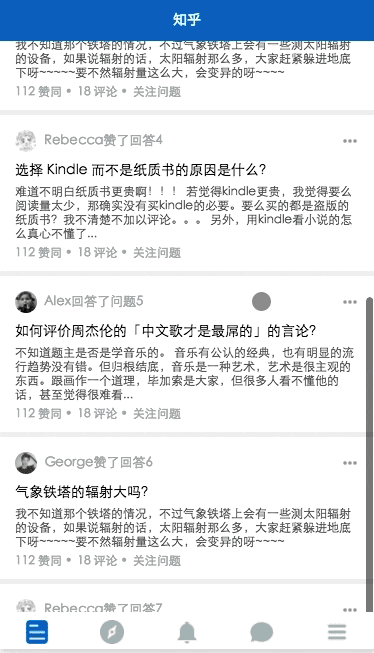
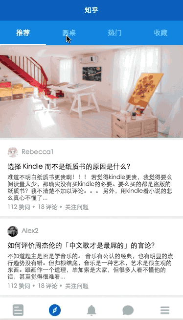
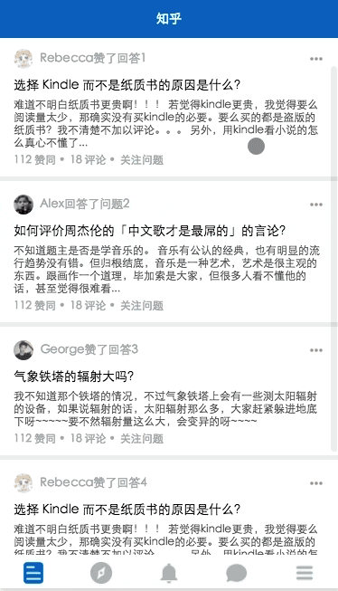

# zhihu-mini-program
### description
- 界面及交互设计来自知乎 Android 版本
- _工具_: [微信 web 开发者工具](https://mp.weixin.qq.com/debug/wxadoc/dev/devtools/download.html?t=1477579747265)
- _数据_: API访问存在权限, 所以使用伪造本地数据

#### 功能及使用的组件等
* 列表式渲染数据
* 自定义顶部 tabbar
* 下拉刷新
* 上拉加载更多

### Setup
下载安装Wechat DEV Tools, 并导入项目

### 演示

首页下拉刷新等

底部 tab 切换

顶部自定义 tab 切换

页面跳转

